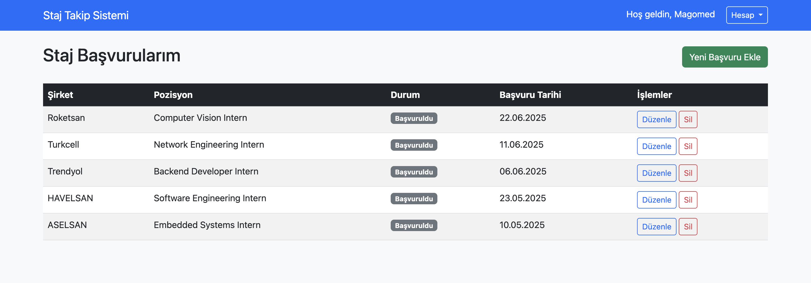

# Staj Başvuru Takip Sistemi

A web-based internship application tracking system developed with PHP and MySQL.  
This project helps students manage and track their internship applications in an organized way.

---

## Project Purpose

One of the biggest challenges students face during the internship application process is keeping track of:
- which companies they applied to,
- application dates,
- and the current status of each application.

This system aims to simplify and organize the internship search process by providing an easy-to-use tracking platform.

---

## Features

### User Management
- Secure registration system with password hashing
- Session-based authentication
- Account deletion functionality

### Application Management
- Add new internship applications
- View all applications in a structured table
- Edit existing application information
- Delete unnecessary applications

---

## Technologies Used

- **Backend:** PHP (without framework)
- **Database:** MySQL
- **Frontend:** HTML5, CSS3, JavaScript
- **CSS Framework:** Bootstrap 5.3
- **Security:** Password Hashing, Sessions

---

## Project Structure

```text
project/
│
├── public/
│   ├── index.php
│   ├── login.php
│   ├── register.php
│   ├── logout.php
│   ├── dashboard.php
│   ├── add.php
│   ├── edit.php
│   ├── delete.php
│   └── delete_account.php
│
├── config/
│   └── database.php
│
├── database/
│   └── database.sql
│
├── screenshots/
│
├── assets/
│
└── README.md
```

---

## Installation

### 1. Clone the repository

```bash
git clone https://github.com/umkhanov/internship-application-tracker.git
```

### 2. Start MySQL service

### 3. Create a database

```sql
CREATE DATABASE dbstorage22360859374;
```

### 4. Import the SQL file

```bash
mysql -u root dbstorage22360859374 < database/database.sql
```

### 5. Run the PHP development server

```bash
php -S localhost:8000 -t public
```

### 6. Open in browser

```text
http://localhost:8000
```

---

## Usage

### Register an Account
- Open the main page
- Create a new account using username, email and password

### Add Internship Applications
- Click on **"Yeni Başvuru Ekle"**
- Enter company name, position, application date and notes

### Manage Applications
- View all applications on the dashboard
- Edit application information
- Delete unnecessary applications

---

## Screenshots

### Main Page


### Dashboard



---

## Technical Notes

- PHP 7.4+ required
- MySQL 5.7+ supported
- Bootstrap loaded via CDN
- JavaScript-enabled browser required

---

## Future Improvements

- Search and filtering functionality
- Email notifications
- Application statistics
- Dark mode support
- Admin dashboard

---

## Author

Magomed Umkhanov  
Computer Engineering Student
